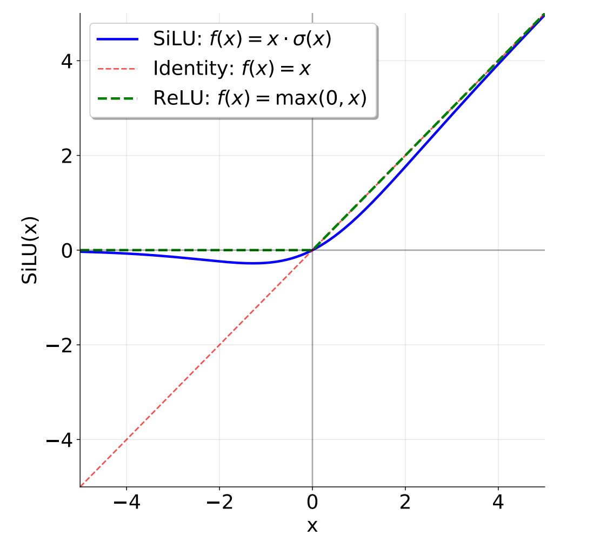

# Position-Wise Feed-Forward

After contextualizing token representations through the causal multi-head self-attention layer (and another RMSNorm layer), the model processes each token's representation individually. This is the role of the **Position-Wise Feed-Forward Network (FFN)**.

While self-attention allows tokens to *communicate* with one another across the sequence dimension, the FFN allows each token to *synthesize features* and build deeper representations in isolation. It is applied to each position separately and identically, mapping the attention-rich features into a higher-dimensional space to perform non-linear transformations before projecting them back.

In modern LLMs, the traditional feed-forward design has evolved significantly. This layer incorporates:

* **SwiGLU Activation**: Combines the smooth non-linearity of the SiLU (Swish) activation function with a Gated Linear Unit (GLU) to enhance gradient flow and representation capacity.

* **No Bias Terms**: Follows modern architectures by omitting bias parameters across all linear transformations to improve training stability and efficiency.

* **Optimized Dimensional Scaling**: Scales the intermediate dimension ($d_{\text{ff}}$) to approximately $\frac{8}{3}d_{\text{model}}$, keeping the computation and parameter count balanced while adopting a three-matrix gating mechanism.

---

## The Evolution of the FFN: From ReLU to SwiGLU

In the original Transformer paper, the feed-forward network consisted of two linear transformations with a ReLU activation ($\text{ReLU}(x) = \max(0, x)$) between them:

$$
\text{FFN}_{\text{ReLU}}(x) = \max(0, W_1 x + b_1) W_2 + b_2
$$

In that original architecture, the dimensionality of the inner feed-forward layer $d_{\text{ff}}$ was typically $4 \times d_{\text{model}}$.

However, modern language models tend to incorporate two main changes compared to this original design: they use another activation function and employ a gating mechanism. Specifically, this is the **SwiGLU** activation function adopted in LLMs like Llama 3 and Qwen 2.5, which combines the SiLU (often called Swish) activation with a gating mechanism called a Gated Linear Unit (GLU).

The bias terms will also be omitted in linear layers, following most modern LLMs since PaLM and LLaMA.

### SiLU (Swish) Activation

The **SiLU** or **Swish** activation function is defined as follows:

$$
\text{SiLU}(x) = x \cdot \sigma(x) = \frac{x}{1 + e^{-x}}
$$

The SiLU activation function is similar to the ReLU activation function, but is smooth at zero. This smooth non-linearity avoids the dead-neuron problem of ReLU and provides more stable gradient dynamics during training.

### Gated Linear Units (GLUs)

Gated Linear Units (GLUs) is the element-wise product of a linear transformation passed through a sigmoid function and another linear transformation:

$$
\text{GLU}(x, W_1, W_2) = \sigma(W_1 x) \odot W_2 x
$$

where $\odot$ represents element-wise multiplication. Gated Linear Units are suggested to "reduce the vanishing gradient problem for deep architectures by providing a linear path for the gradients while retaining non-linear capabilities."

### Combining Them: SwiGLU

Putting the SiLU/Swish and GLU together, we get the **SwiGLU** activation, which we will use for the feed-forward networks:

$$
\text{FFN}_{\text{SwiGLU}}(x) = \text{SwiGLU}(x, W_1, W_2, W_3) = W_2 \left( \text{SiLU}(W_1 x) \odot W_3 x \right)
$$

Where:

* $x \in \mathbb{R}^{d_{\text{model}}}$ represents the hidden state vector.

* $W_1, W_3 \in \mathbb{R}^{d_{\text{ff}} \times d_{\text{model}}}$ are projection matrices that map the input into the higher-dimensional intermediate space.

* $W_2 \in \mathbb{R}^{d_{\text{model}} \times d_{\text{ff}}}$ projects the combined features back down to the model dimension.

* Bias terms are omitted entirely ($b_1 = b_2 = b_3 = 0$).

## Dimension Scaling and Hardware Efficiency

Because SwiGLU utilizes three projection matrices ($W_1$, $W_2$, and $W_3$) instead of the two used in the classic ReLU FFN ($W_1$ and $W_2$), keeping $d_{\text{ff}} = 4 \times d_{\text{model}}$ would increase the parameter count and computational cost of the layer by 50%.

To keep the parameter and FLOP budget similar to a standard FFN, the intermediate dimension $d_{\text{ff}}$ is scaled down. Canonically, we use:

$$
d_{\text{ff}} = \frac{8}{3} d_{\text{model}}
$$

### Hardware Alignment (Rounding to Multiples of 64)

In concrete implementations, it is fine to round $d_{\text{ff}}$ to a nearby multiple of 64. This optimizes memory alignment and hardware execution efficiency on modern GPUs (e.g., leveraging Tensor Cores).

For example, if $d_{\text{model}} = 4096$:

$$
d_{\text{ff}} \approx \frac{8}{3} \times 4096 = 10922.67 \longrightarrow \text{round to nearest multiple of 64} \longrightarrow 10944
$$

---

## Dimensional Transformation Overlook of the SwiGLU FFN

### Learnable Parameters (No Biases)

* **$W_1$ Weight Matrix**: Shape `(d_ff, d_model)`

* **$W_3$ Weight Matrix**: Shape `(d_ff, d_model)`

* **$W_2$ Weight Matrix**: Shape `(d_model, d_ff)`

### Step-by-Step Dimensional Transformations

* **Input Tensor Shape**: `(batch_size, sequence_length, d_model)` (abbreviated as `(B, T, d_model)`).

* **Parallel Linear Projections ($W_1$ and $W_3$)**:

  * We project the input tensor through $W_1$ and $W_3$ independently.

  * **Shape transformation**:

    $$
x W_1^T \longrightarrow \text{Shape: } (B, T, d_{\text{ff}})
$$

    $$
x W_3^T \longrightarrow \text{Shape: } (B, T, d_{\text{ff}})
$$

* **Activation and Gated Element-Wise Multiplication**:

  * Apply the element-wise SiLU activation to the first projection, then compute the element-wise product with the second projection.

  * **Shape transformation**:

    $$
\text{SiLU}(x W_1^T) \odot (x W_3^T) \longrightarrow \text{Shape: } (B, T, d_{\text{ff}})
$$

* **Down-Projection ($W_2$)**:

  * Project the gated representation back to the model's residual stream dimension.

  * **Shape transformation**:

    $$
\left( \text{SiLU}(x W_1^T) \odot (x W_3^T) \right) W_2^T \longrightarrow \text{Shape: } (B, T, d_{\text{model}})
$$

* **Output Tensor Shape**: `(batch_size, sequence_length, d_model)` (abbreviated as `(B, T, d_model)`).

## FAQs

### Why is this layer called "Position-Wise"?

The term **"position-wise"** means that the feed-forward network is applied to each token (each position in the sequence) **individually and identically**.

Here is what this means in practice:

* **No Cross-Token Communication**: Unlike the Self-Attention layer, which mixes information across different tokens in a sequence, the FFN processes each token's representation in complete isolation. The computation at position $t$ does not depend on the token at position $t-1$ or $t+1$.

* **Shared Weights**: The exact same weight matrices ($W_1$, $W_2$, and $W_3$) are applied to every single position in the sequence.

#### A Helpful Mental Model

If you were to shuffle the tokens in your input sequence, pass them through the FFN, and then un-shuffle them back to their original order, the resulting representations would be exactly the same as if you had passed them through the FFN in order. This independence is why the sequence length dimension $T$ in the tensor shape `(B, T, d_model)` can be treated essentially like an extra batch dimension during this step.