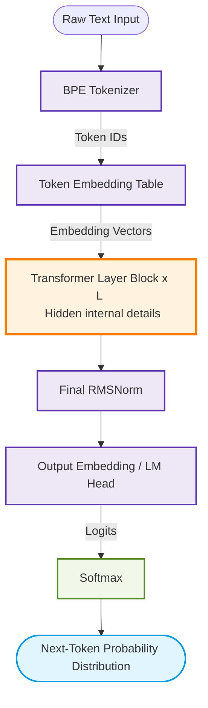
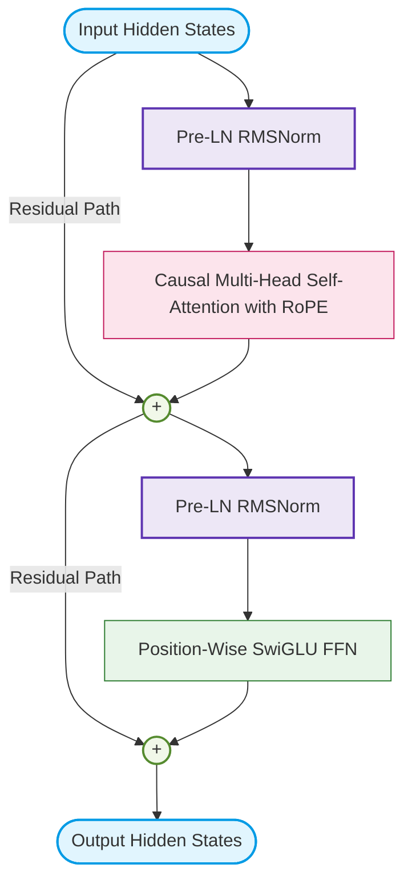

# Architecture

This document provides a high-level overview of the modern Large Language Model (LLM) architecture detailed in this section. The model is an autoregressive, decoder-only Transformer utilizing modern improvements such as Pre-LN RMSNorm, Rotary Position Embeddings (RoPE), SwiGLU activations, and shared Input-Output embeddings.

### High-Level Architecture Overview

### Transformer Layer Block Internal Details

### Architectural Pipeline Flow

#### High-Level Pipeline Components

* **Raw Text Input**: The source sequence of natural language characters or words.

* [**BPE Tokenizer**](/LLM%20Architecture/1-tokenizer.md): Converts raw input text into a sequence of discrete integer tokens using Byte-Pair Encoding.

* [**Token Embedding Table**](/LLM%20Architecture/3-token-embedding.md): A lookup table that maps each token ID to a high-dimensional vector space representation.

* [**Transformer Layer Block**](/LLM%20Architecture/5-causal-multi-head-self-attention-with-rope.md) (× L): The core stack of $L$ repeated layers that iteratively transform the token representations.

* [**Final RMSNorm**](/LLM%20Architecture/4-rms-normalization.md): Applied after the final transformer block to stabilize gradients and normalize the final representations.

* [**Output Embedding / LM Head**](/LLM%20Architecture/8-output-embedding.md): Projects the normalized hidden states back into the vocabulary space to generate logits.

* **Softmax**: Converts the raw vocabulary logits into a normalized probability distribution.

* **Next-Token Probability Distribution**: The predicted probabilities for the subsequent token.

#### Transformer Layer Block Components

* **Input Hidden States**: The representation vector entering the block.

* [**Pre-LN RMSNorm (RMS1 & RMS2)**](/LLM%20Architecture/4-rms-normalization.md): Root Mean Square Normalization applied in a pre-layer normalization configuration (before the attention and feed-forward layers) to facilitate stable deep network training.

* [**Residual Paths & Addition Nodes ((+))**](/LLM%20Architecture/6-residule-path.md): Skip connections that add the inputs of a sub-layer back to its output, bypassing the transformations to preserve gradient flow.

* [**Causal Multi-Head Self-Attention with RoPE**](/LLM%20Architecture/5-causal-multi-head-self-attention-with-rope.md): Processes token-to-token dependencies. It uses a causal attention mask to preserve autoregressive properties and injects relative positional information using Rotary Position Embeddings (RoPE).

* [**Position-Wise SwiGLU FFN**](/LLM%20Architecture/7-position-wise-feed-forward.md): A feed-forward network block that uses the Gated Linear Unit with Swish activation (SwiGLU) for non-linear, high-capacity token representation transformations.

* **Output Hidden States**: The final transformed representation vector exiting the block.