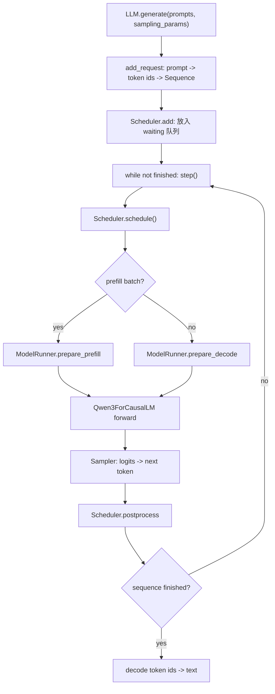

# 01. 项目地图和主流程

Nano-VLLM 的代码可以按三层理解：

1. API 层：接收 prompt 和采样参数，暴露类似 vLLM 的 `LLM.generate`。
2. Engine 层：管理请求、调度批次、KV cache block、GPU runner。
3. Model/layers 层：实现 Qwen3 推理、张量并行、FlashAttention 和采样。

## 最小使用路径

`example.py` 展示了典型用法：

```python
from nanovllm import LLM, SamplingParams

llm = LLM("/YOUR/MODEL/PATH", enforce_eager=True, tensor_parallel_size=1)
sampling_params = SamplingParams(temperature=0.6, max_tokens=256)
outputs = llm.generate(["Hello, Nano-vLLM."], sampling_params)
```

`LLM` 本身只是继承 `LLMEngine`，所以真正入口在 `nanovllm/engine/llm_engine.py`。

## 一次生成的主流程



## 为什么代码能保持很小

这个项目把很多复杂性压缩到了少数关键抽象里：

- `Sequence` 保存请求的 token、生成状态和 block table。
- `Scheduler` 只处理两个队列：`waiting` 和 `running`。
- `BlockManager` 只管理固定大小 block，不做复杂内存碎片整理。
- `ModelRunner` 是 CPU 调度世界和 GPU 模型世界之间的边界。
- `Context` 是一次 forward 的临时全局信息，让 attention 层不用显式传一长串参数。

## 和完整 vLLM 的关系

Nano-VLLM 复现的是核心推理机制，而不是完整服务系统。它包含：

- continuous batching 的基本思想；
- prefill/decode 分离；
- paged KV cache；
- prefix caching；
- tensor parallel；
- FlashAttention；
- CUDA graph decode 加速。

它没有实现完整 vLLM 的多模型支持、复杂服务端、丰富采样策略、调度策略配置、LoRA、结构化输出等生产系统能力。正因为边界小，它适合拿来学习 vLLM 的核心实现。

下一章：[入口 API、配置和请求对象](./02-api-config-sequence.md)

