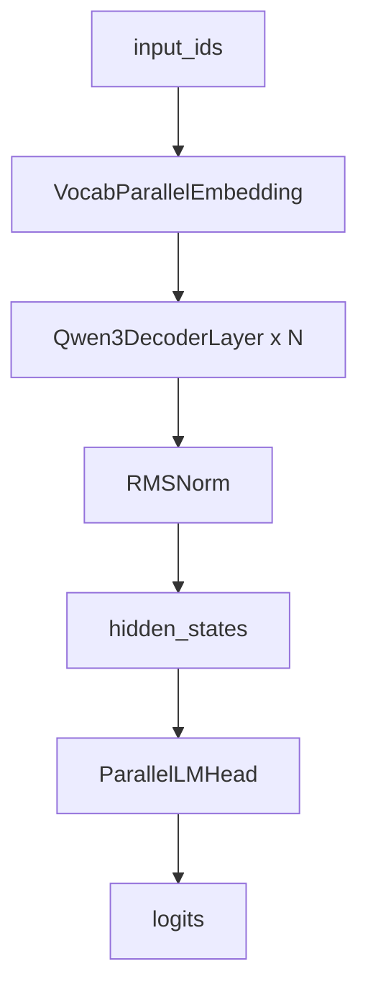

# 06. Qwen3 模型结构

Nano-VLLM 只实现了 Qwen3 推理所需的模型结构。核心文件是 `nanovllm/models/qwen3.py`。

整体结构是：



## Qwen3ForCausalLM

最外层类包含：

- `self.model = Qwen3Model(config)`
- `self.lm_head = ParallelLMHead(...)`

它的 `forward` 只返回 hidden states：

```python
return self.model(input_ids, positions)
```

logits 通过单独的 `compute_logits(hidden_states)` 计算。这种拆分方便 `ModelRunner` 在 CUDA graph 路径中只 capture transformer forward，再统一计算 logits。

## packed_modules_mapping

Qwen3 的 HF 权重里通常有独立的：

- `q_proj`
- `k_proj`
- `v_proj`
- `gate_proj`
- `up_proj`

Nano-VLLM 在模型里把它们合并成：

- `qkv_proj`
- `gate_up_proj`

所以 `Qwen3ForCausalLM.packed_modules_mapping` 定义了权重名替换规则：

```python
{
    "q_proj": ("qkv_proj", "q"),
    "k_proj": ("qkv_proj", "k"),
    "v_proj": ("qkv_proj", "v"),
    "gate_proj": ("gate_up_proj", 0),
    "up_proj": ("gate_up_proj", 1),
}
```

加载权重时，loader 会用这个映射把多个 HF 参数塞进一个合并参数的不同分片。

## Qwen3Model

`Qwen3Model` 包含：

1. vocab parallel embedding；
2. 多层 decoder layer；
3. 最终 RMSNorm。

forward 逻辑非常直：

```python
hidden_states = self.embed_tokens(input_ids)
residual = None
for layer in self.layers:
    hidden_states, residual = layer(positions, hidden_states, residual)
hidden_states, _ = self.norm(hidden_states, residual)
```

这里的 RMSNorm 支持 fused residual add。layer 之间传递 `hidden_states` 和 `residual`，减少额外对象和重复加法。

## Qwen3DecoderLayer

每层包含：

- `self_attn`
- `mlp`
- `input_layernorm`
- `post_attention_layernorm`

forward 流程：

1. input RMSNorm，并维护 residual。
2. self attention。
3. post-attention RMSNorm，并把 attention 输出加到 residual。
4. MLP。
5. 返回新的 hidden states 和 residual。

这个结构对应 decoder-only transformer 的常见 pre-norm 形式。

## Qwen3Attention

Attention 层做了几件事：

1. `qkv_proj` 一次性产生 q/k/v。
2. reshape 成多头形状。
3. 如果没有 qkv bias，则对 q/k 做 RMSNorm。
4. 应用 RoPE。
5. 调用 `Attention` 模块执行 FlashAttention 和 KV cache 写入。
6. `o_proj` 做输出投影。

因为支持 tensor parallel，每个 rank 只持有一部分 attention heads 和 KV heads。

## Qwen3MLP

MLP 使用 SwiGLU 形式：

```python
gate_up = self.gate_up_proj(x)
x = self.act_fn(gate_up)
x = self.down_proj(x)
```

`SiluAndMul` 会把 `gate_up` 沿最后一维切成两半：

```python
x, y = x.chunk(2, -1)
return F.silu(x) * y
```

这对应 `silu(gate) * up`。

上一章：[ModelRunner：从序列到 GPU 张量](./05-model-runner.md)  
下一章：[Attention、上下文对象和 FlashAttention](./07-attention-context.md)

